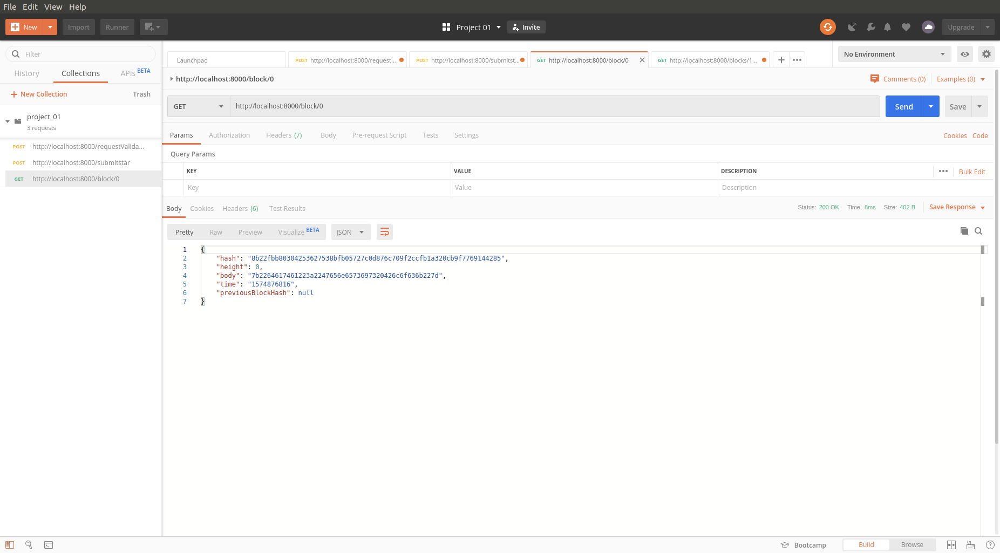
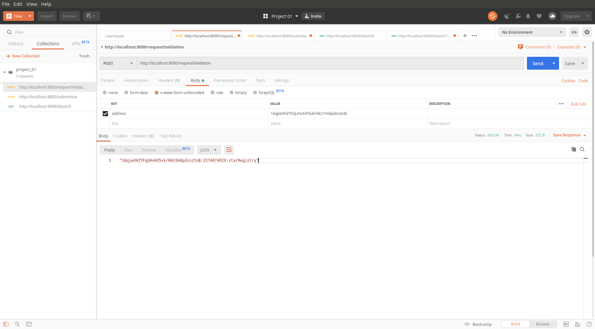
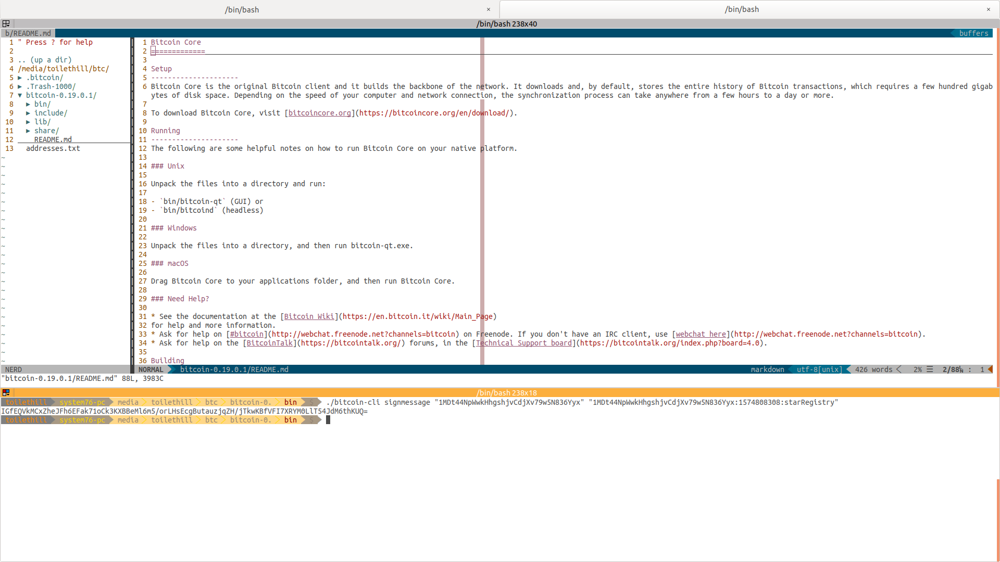
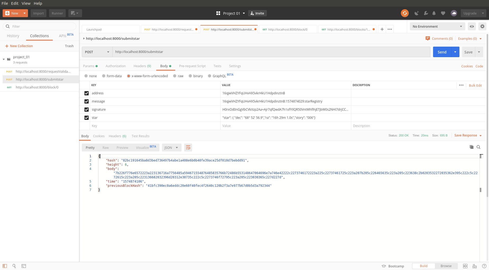
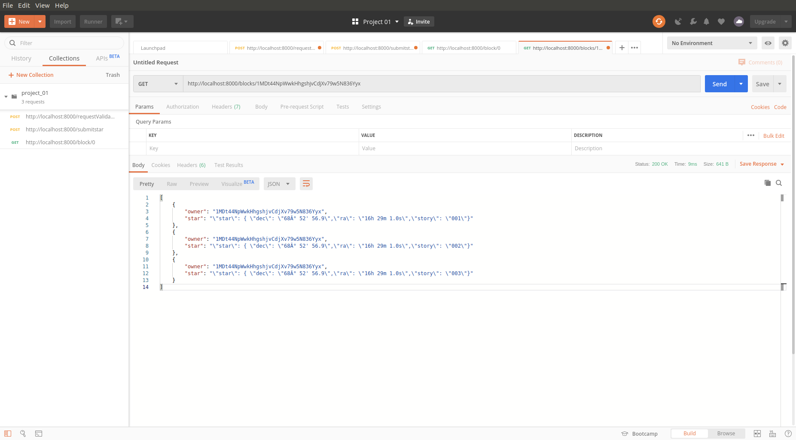

# Private Blockchain Application
__Project 01 of Udacity's *Blockchain Developer Nanodegree* ND1309__

## The Journey to Blockchain Developer

- This project demonstrates fundamentals concepts of a Blockchain platform.
- Concepts like:
    - Block
    - Blockchain
    - Wallet
    - Blockchain Identity
    - Proof of Existance

## Quickstart

Spinning up a NixOs Docker container and running Nix Shell.

1. ```git clone https://github.com/heathdrobertson/private_blockchain.git```
1. ```cd private_blockchain```
1. ```docker create --name nix -v /nix nixos/nix sh```
1. ```docker run --rm --volumes-from=nix -it -v $(pwd):/app -w /app -p 8000:8000 nixos/nix nix-shell /app/.config/default.nix```
    1. Visit [ToiletHill.io](https://toilethill.io) for `docker run` command expalnation.


## Screenshots

1. must use a GET call to request the Genesis block

1. must use a POST call to requestValidation

1. must sign message with your wallet

1. must submit your Star

1. must use GET call to retrieve starts owned by a particular address

