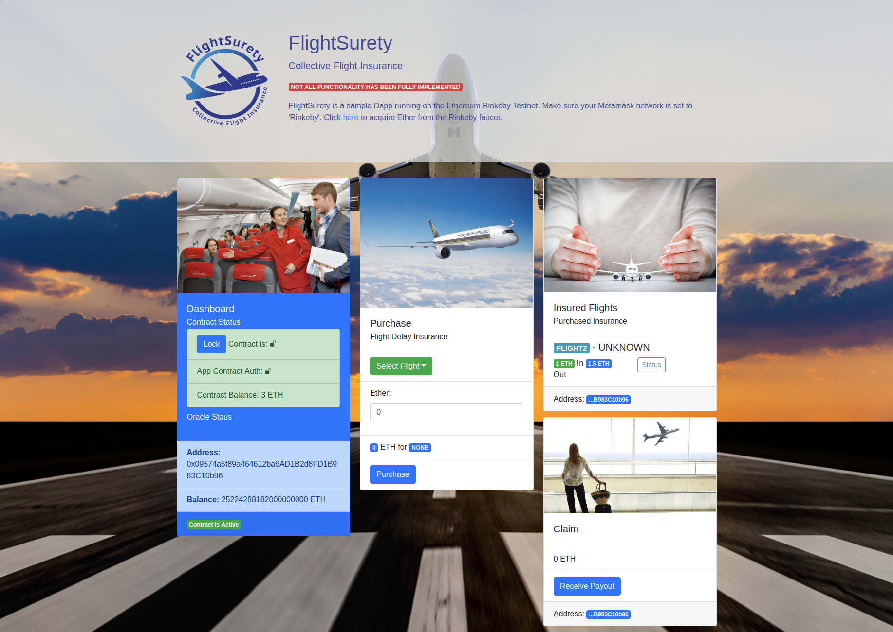

# Flight Surety
__Ethereum Dapp for Passenger Flight Delay Insurance__

> [flt.toilethill.io](https://flt.toilethill.io/) - Live sample Dapp Running On Rinkeby Testnet

## Udacity - Blockchain Developer Nanodegree - Project 04

**Project Specifications**
* Flight delay insurance for passengers.
* Managed as collaboration between multiple airlines.
* Passengers can purchase insurance prior to flight.
* If flight is delayed due to airline fault (LATE AIRLINE), passengers are paid 1.5X the amount they paid for the insurance.

### Admin View



## Quick Start

#### Terminal Window (1 of 4)
1. Clone it:
```bash
git clone https://github.com/heathdrobertson/flight_surety.git
```
2. Setup [NeoVim](./.config/NEOVIM.md) Container

#### Terminal Windows (2-4)
1. [Ethereum Dapp Development Environment](./.config/SETUP.md)

___
### A Note About My Development Process

- I develop my projects with a network of Docker containers.
- Each container is running NixOs and loads a `nix-shell` environment.
- I typically have two containers running with a third data container to persist nix packages.
- Nix environments are built with `.nix` derivations and copied into the containers on build. 

1.  [Data Container](http://toilethill.io/notes/nixos)
2.  [NeoVim](./.config/NEOVIM.md) IDE Container
3.  [Project Environment](./.config/SETUP.md) (with mulitple interactive terminal sessions).


___
### [Heath Robertson](http://www.heathrobertson.com/) | [ToiletHill.io](http://toilethill.io/)
[CodeHappens@ToiletHill.io](mailto:CodeHappens@ToiletHill.io?subject=[GitHub]%20Repo) | [Telegram](http://t.me/heathdrobertson) | [Twitter](https://twitter.com/heathdrobertson) | [GitHub](https://github.com/heathdrobertson)

